# How to setup auto shout outs

There are two ways to do this (maybe more, but I'm covering two).

## First Method

This method requires that the person has chatted in your chat before hand.

1. Click the **Hamburger** icon to open all your options.

    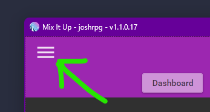

2. Click on **Users**

    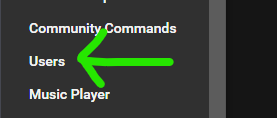

3. Find the user you wish add the auto shout out for and click the **Edit** icon next to their name.

    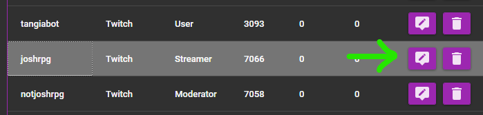

4. Find the **Options** section and click **Add Command** next to **Custom Entrance Command**

    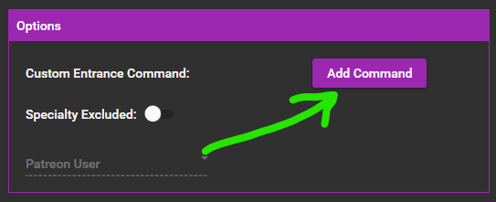

5. On the **Command Editor** windows set the **action** to **Chat Message** and click the **+** icon.

    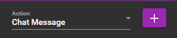

6. Set your chat message as you like, IE see image below. **\$username** is self explanatory and **\$userurl** is going to be their twitch link.

    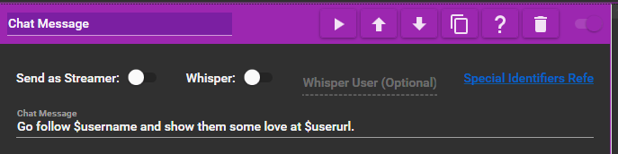

## Second Method

This method does not require them to have ever chatted in your chat before.

1. Click the **Hamburger** icon to open all your options.

    

2. Click on **Events**

    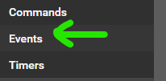

3. Click on **Chat**, **Chat User Entrance Commands**, then the **Edit** button.

    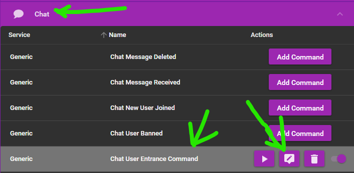

4. On the **Command Editor** windows set the **action** to **Chat Message** and click the **+** icon.

    

5. I set conditions for each person I wanted to auto shout out. Set the **Operator** to **OR**. Set the **First Value** to **\$username**, the **Compare** to **=**, and the **Second Value** to the persons Twitch username.

    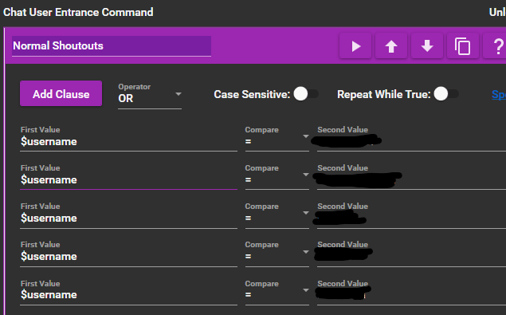

6. Add a **Chat Message** action and set your chat message as you like, IE see image below. **\$username** is self explanatory and **\$userurl** is going to be their twitch link.

    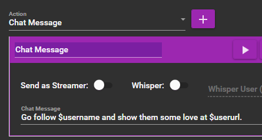

7. If you want special messages for certain individuals, you follow the same method but you make them their own main **Chat Message** action. If you notice in the screenshot on step 5, I renamed it to **Normal Shoutouts**.

    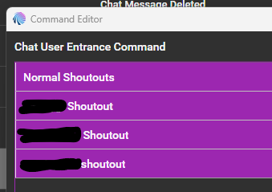
