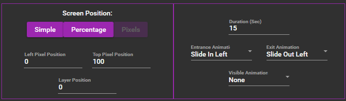

# BG3 Approval Redeem

Credit to [Marrowmage](https://twitter.com/marrowmage) and here is their [Twitch](https://www.twitch.tv/marrowmage).

Original post is [here](https://twitter.com/marrowmage/status/1736230454473171061?s=20).

This is my slightly modified version and it also assumes that you have Mix It Up setup and connected to the streaming software.

1. Create your redeem or command. For this guide I will be using a command.
2. On the **Action** drop down choose **Overlay (Images & Videos)** and then click the **+**

    

3. Change **Action** from **Text** to **HTML**

    

4. Paste this code into the **HTML Textbox**

    ```HTML
    <style>
        body { background-color: gray;}

        img {
            height: auto;
            max-width: 60px;
        }

        div {
            display:inline;
            float: left;
        }

        .diamond {
            width: 30px;
            height: 30px;
            border-radius: 3px;
            border: double black;
            transform: rotate(45deg);
            position: relative;
            overflow: hidden;
            margin: 30px 0 0 30px;
            outline: 1px solid black;
            display: inline;
        }
        .diamond img {
            max-height: 142%;
            transform: rotate(-45deg);
            margin: -21%;
            z-index: -1;
            position: relative;
        }

        .username {
            font-family: "Times New Roman";
            font-size: 23px;
            color: ivory;
            text-align: left;
            text-shadow: 2px 0 black, 0 -2px black, -2px 0 black, 0 2px black, 3px 3px 3px black;
            position: relative;
            top: 25px;
            left: 15px;
            display: inline;
        }
    </style>
    <body>
        <div>
            <div class="diamond"></div>
            <div class="username">$userdisplayname approves</div>
        </div>
    </body>
    ```

5. Set **Screen Position** to **Pixels** and make everything **0**
6. Set Duration (Sec) to 5 (or as longer if you want it to display longer)
7. Set **Entrance Animation** to **Slide In Left** and **Exit Animation** to **Slide Out Left**.

    

8. You should end up with something like this:

    

Note: If you create this as a command, you probably should set a cooldown! I didn't go over that here!
